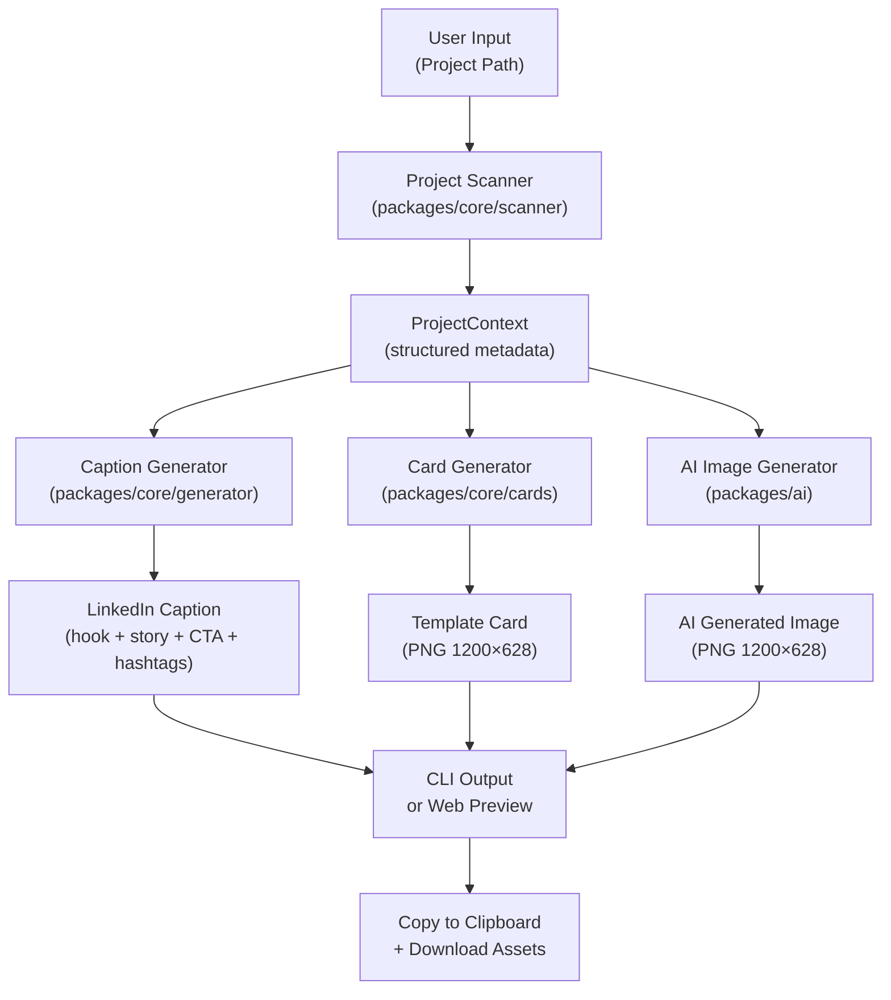
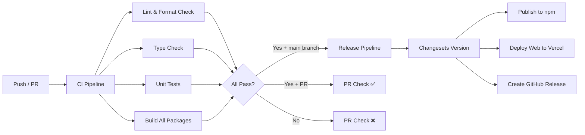

# PostGen — AI-Powered LinkedIn Post Generator

> Generate professional LinkedIn posts from your project directory in seconds.  
> `npx postgen ./my-project` → LinkedIn-ready caption + visual assets

## 1. Problem Statement

Developers build amazing projects but rarely share them on LinkedIn because:
- **Writing is hard** — converting technical work into engaging stories takes time
- **Visual assets are tedious** — creating eye-catching post images requires design skills  
- **Context switching** — going from coding to content creation breaks flow
- **Procrastination cycle** — "I'll post about it later" → never posted

**PostGen solves this** by analyzing a project directory and generating a complete, ready-to-post LinkedIn package in under 60 seconds.

---

## 2. Product Overview

### 2.1 What It Does

User provides a project path → PostGen:

1. **Scans the project** — reads `package.json`, `README.md`, source files, git history, folder structure
2. **Understands the context** — identifies tech stack, architecture, problem being solved
3. **Generates LinkedIn caption** — background story, problem & solution, tech specs, relevant hashtags
4. **Creates visual assets** — template-based project cards + optional AI-generated images
5. **Outputs ready-to-use content** — copy-pasteable text + downloadable images

### 2.2 Delivery Channels

| Channel | Description |
|---------|-------------|
| **CLI** | `npx postgen ./my-project` — terminal-first workflow |
| **Web UI** | `postgen serve` — local dashboard with live preview |

### 2.3 Key Differentiators

- **Zero config** — just point to your project, AI does the rest
- **BYOK** — bring your own API key (Gemini, OpenAI, Anthropic, OpenRouter, any OpenAI-compatible)
- **Offline-capable analysis** — project scanning works without AI; only caption/image gen needs API
- **Open source** — MIT licensed, community-driven

---

## 3. User Stories & Features

### 3.1 Core Features (MVP — Phase 1)

#### F1: Project Scanner
> As a developer, I want PostGen to automatically understand my project so I don't have to manually describe it.

**Scans and extracts:**
- `package.json` / `Cargo.toml` / `pyproject.toml` / `go.mod` / `pom.xml` — name, description, dependencies, scripts
- `README.md` — project description, features, usage
- `.git` — recent commits, contributor count, repo age, languages used
- Source files — folder structure, file count by language, lines of code
- Framework detection — Next.js, React, Vue, Express, FastAPI, Django, Spring Boot, etc.
- Build/deploy config — `Dockerfile`, `vercel.json`, `netlify.toml`, CI configs

**Output:** A structured `ProjectContext` object containing all extracted metadata.

#### F2: Caption Generator  
> As a developer, I want AI to generate an engaging LinkedIn caption from my project context.

**Generates:**
- **Hook** — attention-grabbing first line (LinkedIn shows first ~210 chars)
- **Background story** — why you built this, what problem you faced
- **Problem & Solution** — clear problem statement and how the project solves it
- **Tech stack showcase** — technologies used with brief rationale
- **Key features** — 3-5 bullet points of what makes it special
- **Call to action** — link to repo, ask for feedback, invite collaboration
- **Hashtags** — relevant, optimized hashtags (5-10)

**Customization options:**
- Tone: Professional / Casual / Technical / Storytelling
- Length: Short (< 500 chars) / Medium (500-1500 chars) / Long (1500-3000 chars)
- Language: English / Indonesian / Auto-detect from project
- Focus: Technical deep-dive / Business impact / Personal journey

#### F3: Visual Card Generator (Template-based)
> As a developer, I want a professional-looking project card to attach to my LinkedIn post.

**Template cards include:**
- Project name & tagline
- Tech stack icons (auto-detected)
- Key metrics (stars, commits, LOC, etc.)
- Color theme based on primary framework
- QR code to repo (optional)

**Output:** PNG image (1200×628px — LinkedIn recommended size)

#### F4: AI Image Generator (Optional)
> As a developer, I want to optionally generate a unique AI image that represents my project.

- Uses project context to generate a relevant, professional image
- Supports Gemini image generation or DALL-E
- LinkedIn-optimized aspect ratio
- User can regenerate until satisfied

#### F5: CLI Interface
> As a developer, I want to generate LinkedIn posts from my terminal quickly.

```bash
# Basic usage
npx postgen ./my-project

# With options  
postgen generate ./my-project --tone=storytelling --length=medium --lang=en

# Generate only caption (no image)
postgen generate ./my-project --text-only

# Generate only visual card
postgen card ./my-project --template=modern-dark

# Interactive mode
postgen generate ./my-project -i

# Configure API key
postgen config set provider gemini
postgen config set apiKey <your-key>

# Open web UI
postgen serve --port 3000
```

#### F6: Web Dashboard
> As a developer, I want a visual interface to preview and customize my LinkedIn post before copying.

**Features:**
- Drag & drop project folder or enter path
- Live LinkedIn post preview (mockup of actual LinkedIn post card)
- Caption editor with AI regeneration
- Template card selector with live preview
- One-click copy (caption) and download (images)
- History of generated posts
- Settings panel for API configuration

---

### 3.2 Extended Features (Phase 2 — Post-MVP)

| Feature | Description |
|---------|-------------|
| **Multi-post series** | Generate a thread/carousel for complex projects |
| **Video generator** | Auto-generate short demo video from screenshots |
| **Post scheduler** | Schedule posts via LinkedIn API |
| **Analytics** | Track post performance |
| **Team mode** | Shared templates and brand guidelines |
| **VS Code extension** | Right-click project → Generate LinkedIn Post |

---

## 4. Technical Architecture

### 4.1 Monorepo Structure

```
postgen/
├── apps/
│   └── web/                    # Next.js 15 Web Dashboard
│       ├── app/
│       │   ├── layout.tsx
│       │   ├── page.tsx        # Landing / main generator page
│       │   ├── api/
│       │   │   ├── generate/route.ts    # POST: generate caption
│       │   │   ├── scan/route.ts        # POST: scan project
│       │   │   └── card/route.ts        # POST: generate card image
│       │   └── globals.css
│       ├── components/
│       │   ├── post-preview.tsx         # LinkedIn post mockup
│       │   ├── caption-editor.tsx       # Editable caption with AI regen
│       │   ├── card-selector.tsx        # Template card picker
│       │   ├── project-input.tsx        # Path input / drag-drop
│       │   └── settings-panel.tsx       # API key config
│       ├── package.json
│       └── next.config.ts
│
├── packages/
│   ├── core/                   # Shared business logic
│   │   ├── src/
│   │   │   ├── scanner/
│   │   │   │   ├── index.ts            # Main scanner orchestrator
│   │   │   │   ├── detectors/
│   │   │   │   │   ├── package-json.ts # npm/yarn/pnpm projects
│   │   │   │   │   ├── cargo-toml.ts   # Rust projects
│   │   │   │   │   ├── pyproject.ts    # Python projects
│   │   │   │   │   ├── go-mod.ts       # Go projects
│   │   │   │   │   ├── git.ts          # Git metadata
│   │   │   │   │   ├── readme.ts       # README parser
│   │   │   │   │   └── structure.ts    # Folder/file structure analyzer
│   │   │   │   └── types.ts            # ProjectContext type
│   │   │   ├── generator/
│   │   │   │   ├── index.ts            # Caption generation orchestrator
│   │   │   │   ├── prompts.ts          # AI prompt templates
│   │   │   │   ├── post-builder.ts     # Assembles final post
│   │   │   │   └── types.ts            # GenerationOptions, LinkedInPost
│   │   │   ├── cards/
│   │   │   │   ├── index.ts            # Card generation orchestrator
│   │   │   │   ├── templates/          # Card template definitions
│   │   │   │   │   ├── modern-dark.tsx
│   │   │   │   │   ├── gradient.tsx
│   │   │   │   │   ├── minimal.tsx
│   │   │   │   │   └── tech-stack.tsx
│   │   │   │   ├── icons.ts            # Tech stack SVG icons
│   │   │   │   └── renderer.ts         # Template → PNG renderer
│   │   │   └── config/
│   │   │       ├── index.ts            # Config manager
│   │   │       └── types.ts            # Config types
│   │   ├── package.json
│   │   └── tsconfig.json
│   │
│   ├── ai/                     # AI provider abstraction
│   │   ├── src/
│   │   │   ├── index.ts               # AI client factory
│   │   │   ├── providers.ts           # Provider registry (Gemini, OpenAI, etc.)
│   │   │   └── types.ts              # AIProvider, AIConfig types
│   │   ├── package.json
│   │   └── tsconfig.json
│   │
│   └── shared/                 # Shared types & utilities
│       ├── src/
│       │   ├── types.ts               # Shared type definitions
│       │   ├── constants.ts           # Shared constants
│       │   └── utils.ts              # Shared utility functions
│       ├── package.json
│       └── tsconfig.json
│
├── cli/                        # CLI application
│   ├── src/
│   │   ├── index.ts                   # Entry point, commander setup
│   │   ├── commands/
│   │   │   ├── generate.ts            # Main generate command
│   │   │   ├── card.ts                # Card-only generation
│   │   │   ├── config.ts              # Config management
│   │   │   └── serve.ts              # Launch web UI
│   │   ├── ui/
│   │   │   ├── spinner.ts             # Loading animations
│   │   │   ├── prompts.ts            # Interactive prompts
│   │   │   └── output.ts            # Formatted output
│   │   └── utils.ts
│   ├── package.json
│   └── tsconfig.json
│
├── .github/
│   └── workflows/
│       ├── ci.yml                     # Lint, test, build on every PR
│       ├── release.yml                # Semantic release to npm
│       └── deploy.yml                 # Deploy web UI to Vercel
│
├── turbo.json                         # Turborepo pipeline config
├── pnpm-workspace.yaml                # pnpm workspace config
├── package.json                       # Root package.json
├── tsconfig.base.json                 # Shared TS config
├── .eslintrc.js                       # Shared ESLint config
├── .prettierrc                        # Shared Prettier config
├── LICENSE                            # MIT License
├── README.md                          # Project README
├── CONTRIBUTING.md                    # Contribution guide
└── .env.example                       # Example env vars
```

### 4.2 Data Flow



### 4.3 Tech Stack

| Layer | Technology | Why |
|-------|-----------|-----|
| **Language** | TypeScript 5.x | Type safety, shared types across monorepo |
| **Monorepo** | pnpm workspaces + Turborepo | Fast builds, dependency management, caching |
| **CLI Framework** | `commander` + `inquirer` | Industry standard, great DX |
| **CLI UI** | `chalk` + `ora` + `cli-table3` | Beautiful terminal output |
| **Web Framework** | Next.js 15 (App Router) | SSR, API routes, fast dev |
| **Web UI** | React 19 + Vanilla CSS | Per user preference, no Tailwind |
| **AI SDK** | Vercel AI SDK (`ai` package) | Multi-provider, streaming, structured output |
| **AI Providers** | `@ai-sdk/google`, `@ai-sdk/openai`, `@ai-sdk/anthropic`, `@openrouter/ai-sdk-provider` | BYOK support |
| **Structured Output** | `zod` | Schema validation for AI responses |
| **Image Generation** | `@vercel/og` (Satori) + `sharp` | Template cards (SVG→PNG) |
| **Git Analysis** | `simple-git` | Git metadata extraction |
| **File Analysis** | `fast-glob` + `fs-extra` | File system traversal |
| **Config** | `conf` | Persistent user config (API keys, preferences) |
| **Testing** | Vitest + Playwright | Unit + E2E testing |
| **Linting** | ESLint + Prettier | Code quality |
| **CI/CD** | GitHub Actions | Automated pipeline |
| **Packaging** | `tsup` | Bundle CLI & packages for npm |
| **Release** | `changesets` | Versioning & changelog management |

### 4.4 AI Provider Configuration

```typescript
// BYOK — users configure their own provider
// Stored in ~/.postgen/config.json

interface PostGenConfig {
  provider: 'gemini' | 'openai' | 'anthropic' | 'openrouter' | 'custom';
  apiKey: string;
  model?: string;           // e.g., 'gemini-2.5-flash', 'gpt-4o', 'claude-sonnet-4-20250514'
  baseUrl?: string;         // For custom OpenAI-compatible endpoints
  imageProvider?: 'gemini' | 'openai' | 'none';  // For AI image gen
  imageModel?: string;
}
```

**Provider support via Vercel AI SDK:**

```typescript
import { generateText, Output } from 'ai';
import { google } from '@ai-sdk/google';
import { openai } from '@ai-sdk/openai';
import { anthropic } from '@ai-sdk/anthropic';
import { openrouter } from '@openrouter/ai-sdk-provider';

// Factory function — returns the right provider based on config
function getModel(config: PostGenConfig) {
  switch (config.provider) {
    case 'gemini':    return google(config.model ?? 'gemini-2.5-flash');
    case 'openai':    return openai(config.model ?? 'gpt-4o');
    case 'anthropic': return anthropic(config.model ?? 'claude-sonnet-4-20250514');
    case 'openrouter': return openrouter(config.model ?? 'google/gemini-2.5-flash');
    case 'custom':    return openai.createModel(config.model ?? 'default', { baseUrl: config.baseUrl });
  }
}
```

### 4.5 Core Types

```typescript
// packages/shared/src/types.ts

interface ProjectContext {
  name: string;
  description: string;
  path: string;
  
  // Package info
  packageManager: 'npm' | 'yarn' | 'pnpm' | 'cargo' | 'pip' | 'go' | 'maven' | 'unknown';
  version?: string;
  license?: string;
  
  // Tech stack
  languages: { name: string; percentage: number; files: number }[];
  frameworks: string[];        // e.g., ['Next.js', 'React', 'Prisma']
  dependencies: string[];      // Major deps only
  devDependencies: string[];
  
  // Git info
  git: {
    totalCommits: number;
    recentCommits: { message: string; date: string; author: string }[];
    contributors: number;
    firstCommitDate: string;
    lastCommitDate: string;
    remoteUrl?: string;
  } | null;
  
  // Structure
  structure: {
    totalFiles: number;
    totalDirectories: number;
    linesOfCode: number;
    tree: string;              // ASCII tree representation (top-level)
  };
  
  // README content
  readme: string | null;
  
  // Build/Deploy
  hasDocker: boolean;
  hasCi: boolean;
  deployTarget?: string;       // 'vercel', 'netlify', 'aws', etc.
}

interface LinkedInPost {
  caption: string;
  hook: string;                // First line (for preview)
  hashtags: string[];
  estimatedReadTime: string;   // e.g., '30 sec read'
  charCount: number;
  
  // Visual assets
  templateCard?: {
    imageBuffer: Buffer;
    format: 'png';
    width: number;
    height: number;
  };
  aiImage?: {
    imageBuffer: Buffer;
    format: 'png';
    url?: string;
  };
}

interface GenerationOptions {
  tone: 'professional' | 'casual' | 'technical' | 'storytelling';
  length: 'short' | 'medium' | 'long';
  language: 'en' | 'id' | 'auto';
  focus: 'technical' | 'business' | 'personal';
  includeTemplateCard: boolean;
  includeAiImage: boolean;
  templateName?: string;
}
```

---

## 5. CI/CD Pipeline

### 5.1 Overview



### 5.2 CI Workflow (`.github/workflows/ci.yml`)

Triggers on every push and pull request:

```yaml
name: CI

on:
  push:
    branches: [main]
  pull_request:
    branches: [main]

concurrency:
  group: ${{ github.workflow }}-${{ github.ref }}
  cancel-in-progress: true

jobs:
  lint:
    name: Lint & Format
    runs-on: ubuntu-latest
    steps:
      - uses: actions/checkout@v4
      - uses: pnpm/action-setup@v4
      - uses: actions/setup-node@v4
        with:
          node-version: 22
          cache: 'pnpm'
      - run: pnpm install --frozen-lockfile
      - run: pnpm lint
      - run: pnpm format:check

  typecheck:
    name: Type Check
    runs-on: ubuntu-latest
    steps:
      - uses: actions/checkout@v4
      - uses: pnpm/action-setup@v4
      - uses: actions/setup-node@v4
        with:
          node-version: 22
          cache: 'pnpm'
      - run: pnpm install --frozen-lockfile
      - run: pnpm typecheck

  test:
    name: Test
    runs-on: ubuntu-latest
    steps:
      - uses: actions/checkout@v4
      - uses: pnpm/action-setup@v4
      - uses: actions/setup-node@v4
        with:
          node-version: 22
          cache: 'pnpm'
      - run: pnpm install --frozen-lockfile
      - run: pnpm test

  build:
    name: Build
    runs-on: ubuntu-latest
    needs: [lint, typecheck, test]
    steps:
      - uses: actions/checkout@v4
      - uses: pnpm/action-setup@v4
      - uses: actions/setup-node@v4
        with:
          node-version: 22
          cache: 'pnpm'
      - run: pnpm install --frozen-lockfile
      - run: pnpm build
```

### 5.3 Release Workflow (`.github/workflows/release.yml`)

Handles npm publishing and GitHub releases via Changesets:

```yaml
name: Release

on:
  push:
    branches: [main]

permissions:
  contents: write
  pull-requests: write
  id-token: write

jobs:
  release:
    name: Release
    runs-on: ubuntu-latest
    steps:
      - uses: actions/checkout@v4
        with:
          fetch-depth: 0
      - uses: pnpm/action-setup@v4
      - uses: actions/setup-node@v4
        with:
          node-version: 22
          cache: 'pnpm'
          registry-url: 'https://registry.npmjs.org'
      - run: pnpm install --frozen-lockfile
      - run: pnpm build

      - name: Create Release Pull Request or Publish
        id: changesets
        uses: changesets/action@v1
        with:
          publish: pnpm release
          version: pnpm version-packages
          title: 'chore: release packages'
          commit: 'chore: release packages'
        env:
          GITHUB_TOKEN: ${{ secrets.GITHUB_TOKEN }}
          NPM_TOKEN: ${{ secrets.NPM_TOKEN }}
          NODE_AUTH_TOKEN: ${{ secrets.NPM_TOKEN }}
```

### 5.4 Deploy Workflow (`.github/workflows/deploy.yml`)

Deploys the web dashboard to Vercel:

```yaml
name: Deploy Web

on:
  push:
    branches: [main]
    paths:
      - 'apps/web/**'
      - 'packages/**'

jobs:
  deploy:
    name: Deploy to Vercel
    runs-on: ubuntu-latest
    steps:
      - uses: actions/checkout@v4
      - uses: pnpm/action-setup@v4
      - uses: actions/setup-node@v4
        with:
          node-version: 22
          cache: 'pnpm'
      - run: pnpm install --frozen-lockfile
      - run: pnpm build --filter=@postgen/web

      - name: Deploy to Vercel
        uses: amondnet/vercel-action@v25
        with:
          vercel-token: ${{ secrets.VERCEL_TOKEN }}
          vercel-org-id: ${{ secrets.VERCEL_ORG_ID }}
          vercel-project-id: ${{ secrets.VERCEL_PROJECT_ID }}
          vercel-args: '--prod'
          working-directory: apps/web
```

### 5.5 Required GitHub Secrets

| Secret | Purpose |
|--------|---------|
| `NPM_TOKEN` | Publish packages to npm registry |
| `VERCEL_TOKEN` | Deploy web app to Vercel |
| `VERCEL_ORG_ID` | Vercel organization ID |
| `VERCEL_PROJECT_ID` | Vercel project ID |

---

## 6. Package Names & npm Distribution

| Package | npm Name | Description |
|---------|----------|-------------|
| `cli/` | `postgen` | Main CLI package, `npx postgen` |
| `packages/core/` | `@postgen/core` | Shared business logic |
| `packages/ai/` | `@postgen/ai` | AI provider abstraction |
| `packages/shared/` | `@postgen/shared` | Shared types & utils |
| `apps/web/` | `@postgen/web` (private) | Web dashboard, not published |

---

## 7. Configuration & API Key Management

### 7.1 Config File Location

```
~/.postgen/config.json
```

### 7.2 Config Commands

```bash
# Set provider
postgen config set provider gemini

# Set API key (stored locally, never transmitted)
postgen config set apiKey gsk_xxxxx

# Set model
postgen config set model gemini-2.5-flash

# View config
postgen config list

# Reset config
postgen config reset
```

### 7.3 Environment Variables (Alternative)

```bash
POSTGEN_PROVIDER=gemini
POSTGEN_API_KEY=your-key
POSTGEN_MODEL=gemini-2.5-flash
```

> [!IMPORTANT]
> API keys are stored locally in `~/.postgen/config.json` and are **never** transmitted to any server other than the configured AI provider. The web dashboard runs entirely on localhost.

---

## 8. Prompt Engineering

### 8.1 Caption Generation Prompt Template

```
You are an expert LinkedIn content creator who specializes in developer/tech content.

Given the following project context:
- Project name: {name}
- Description: {description}
- Tech stack: {frameworks.join(', ')}
- Languages: {languages}
- Total commits: {git.totalCommits}
- Recent commits (for context): {git.recentCommits}
- README excerpt: {readme}
- Project structure: {structure.tree}

Generate a LinkedIn post with the following structure:

1. **Hook** (first line, max 210 characters) — attention-grabbing, makes people want to click "see more"
2. **Background Story** (2-3 sentences) — why this project was built, the personal motivation
3. **Problem Statement** (1-2 sentences) — the specific problem being solved
4. **Solution** (2-3 sentences) — how the project solves it
5. **Tech Stack & Architecture** (bullet points) — key technologies and why they were chosen
6. **Key Features** (3-5 bullet points) — standout features
7. **Call to Action** — invite feedback, collaboration, or link to repo
8. **Hashtags** (5-10) — relevant, trending tech hashtags

Tone: {options.tone}
Length: {options.length}
Language: {options.language}
Focus: {options.focus}

Output as JSON matching the provided schema.
```

---

## 9. Card Templates

### 9.1 Template Variants

| Template | Style | Best For |
|----------|-------|----------|
| `modern-dark` | Dark background, gradient accent, monospace font | Dev tools, CLI projects |
| `gradient` | Vibrant gradient background, bold typography | SaaS, web apps |
| `minimal` | Clean white, subtle borders, elegant typography | Libraries, packages |
| `tech-stack` | Grid layout showing tech icons prominently | Full-stack projects |

### 9.2 Card Specs

- **Dimensions:** 1200 × 628px (LinkedIn recommended)
- **Format:** PNG
- **Content:** Project name, tagline, tech stack icons, key metric, author
- **Rendered via:** Satori (SVG) → sharp (PNG)

---

## 10. Web Dashboard Design

### 10.1 Pages

| Route | Description |
|-------|-------------|
| `/` | Main generator page — input, preview, export |
| `/settings` | API configuration panel |
| `/history` | Previously generated posts (localStorage) |

### 10.2 UI Components

- **ProjectInput** — path input field + "Browse" button (file dialog via API)
- **ScanProgress** — animated progress showing scanning steps
- **PostPreview** — LinkedIn post mockup (grey background, avatar, post card)
- **CaptionEditor** — editable textarea with character count + "Regenerate" button
- **CardSelector** — template gallery with live preview thumbnails
- **ExportPanel** — "Copy Caption" + "Download Image" buttons
- **SettingsPanel** — provider selector, API key input, model override

---

## 11. Security Considerations

- **API keys stored locally** — `~/.postgen/config.json` with `0600` permissions
- **No telemetry** — zero data collection, fully offline-capable analysis
- **Project scanning is read-only** — never modifies user files
- **`.gitignore` respected** — skips ignored files during scanning
- **`node_modules` excluded** — never scans dependency directories
- **File size limits** — skips binary files and files > 100KB for source analysis
- **Sensitive file detection** — warns if `.env`, secrets, or key files are detected in project

---

## 12. Success Metrics

| Metric | Target |
|--------|--------|
| Time to first post | < 60 seconds |
| npm `npx` cold start | < 10 seconds |
| Caption quality (user satisfaction) | 4/5 stars |
| GitHub stars (6 months) | 500+ |
| npm weekly downloads (6 months) | 1000+ |

---

## 13. Phased Delivery

### Phase 1 — MVP (Target: 2-3 weeks)
- [x] Project scanner (package.json, README, git, structure)
- [x] Caption generator (single provider: Gemini)
- [x] Template card generator (2 templates: modern-dark, minimal)
- [x] CLI with `generate` and `config` commands
- [x] Basic Web UI with preview
- [x] CI pipeline (lint, test, build)
- [x] npm publish via changesets

### Phase 2 — Polish (Target: +2 weeks)
- [ ] All 4 card templates
- [ ] Multi-provider BYOK (OpenAI, Anthropic, OpenRouter)
- [ ] AI image generation
- [ ] Interactive CLI mode
- [ ] Post history (web UI, localStorage)
- [ ] Python/Go/Rust project support (Cargo.toml, pyproject.toml, go.mod)

### Phase 3 — Growth (Target: +4 weeks)
- [ ] Video generator
- [ ] Multi-post series / carousel
- [ ] VS Code extension
- [ ] LinkedIn API integration (direct post)
- [ ] Community templates

---

## 14. Open Questions

> [!IMPORTANT]
> **Q1:** Nama project — apakah `postgen` sudah final, atau mau nama lain? Ini akan jadi npm package name dan brand.

> [!IMPORTANT] 
> **Q2:** Untuk web dashboard — apakah akan di-deploy ke Vercel sebagai hosted service (postgen.dev), atau hanya local-only (`postgen serve`)?

> [!NOTE]
> **Q3:** Apakah perlu support untuk monorepo scanning? (e.g., scanning specific package dalam monorepo)

> [!NOTE]
> **Q4:** Apakah perlu generate multiple caption variations sekaligus untuk dipilih user?

---

## Verification Plan

### Automated Tests
```bash
pnpm test          # Vitest unit tests for all packages
pnpm lint          # ESLint check
pnpm typecheck     # TypeScript type checking
pnpm build         # Build all packages
```

### Manual Verification
- Test CLI with real projects (Node.js, Python, Go)
- Test Web UI di browser (Chrome, Firefox)
- Test all 4 card templates output
- Test BYOK with different providers (Gemini, OpenAI)
- Verify `npx postgen ./project` works cold
